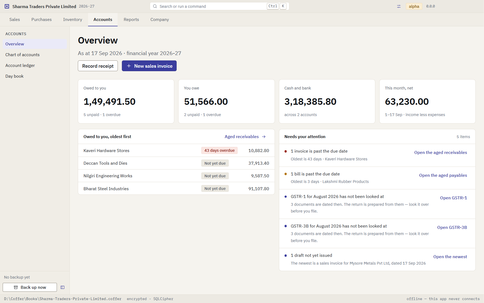
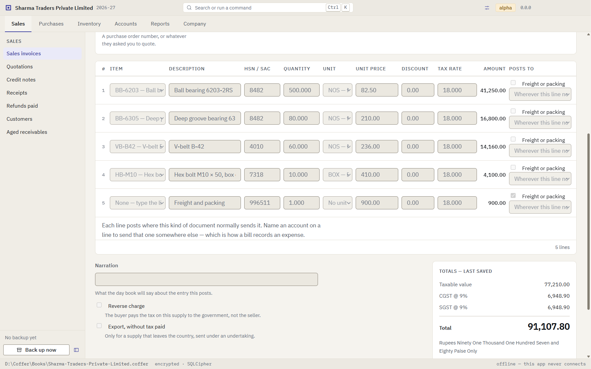
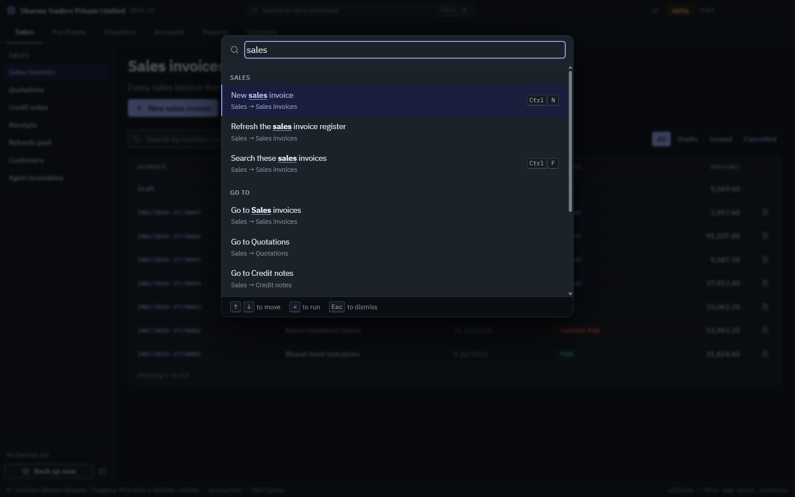
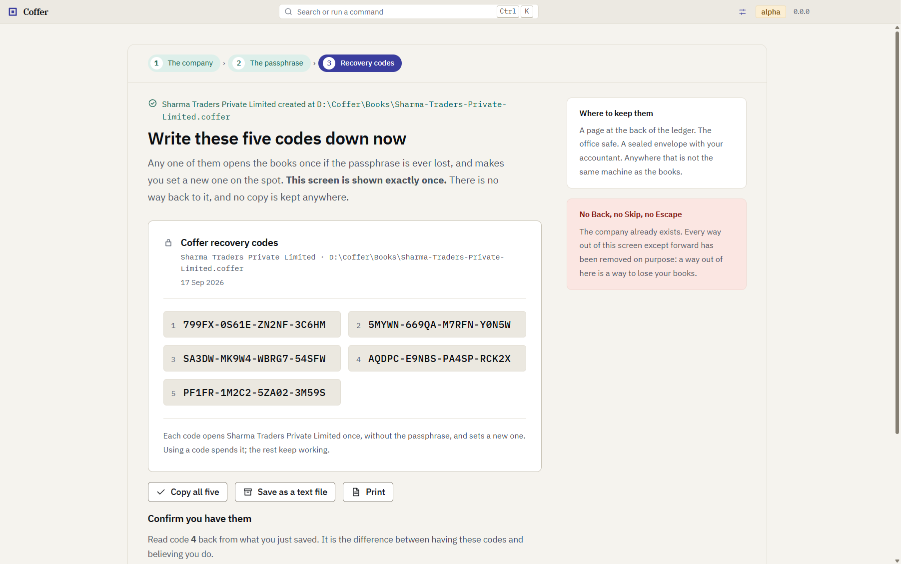

<div align="center">


# Coffer

**Free, open-source accounting and ERP software for small businesses in India — GST
invoicing, double-entry books and inventory, offline and encrypted on your own computer.**

_Your books, in your own safe._

[](https://github.com/abinauv/coffer/actions/workflows/ci.yml)
[](./LICENSE)
[](#status)
[](#install)

</div>

<p align="center">
  
</p>

<table>
  <tr>
    <td width="33%"></td>
    <td width="33%"></td>
    <td width="33%"></td>
  </tr>
</table>

<sub>The current build, with a demo company. Every figure was worked out by the app.</sub>

---

**Coffer is a desktop accounting and ERP application for small and medium businesses
(SMEs and MSMEs) in India.** It keeps real double-entry books, raises GST invoices with
CGST, SGST, UTGST or IGST worked out from the place of supply, prints them, tracks what
customers owe and what you owe suppliers, and prepares GSTR-1 and GSTR-3B for you to check.
It runs entirely offline on Windows, macOS and Linux: each company is one encrypted file on
your own computer, with no account, no subscription and no telemetry. It is free and open
source under the AGPL-3.0 licence, and it is in **alpha** — there is no release to download
yet.

## Status

**Alpha. There is no download yet.** The books work — you can create a company, keep a
chart of accounts, raise, issue and print documents, record what has been paid, run the
statements, look over the month's GST returns, and back the whole company up to one file. What has not
happened is a release: no version has been tagged, so there is nothing on the releases
page to install. [Install](#install) says where it will appear and what to do with it when
it does.

Interfaces still move. Issues and design feedback are welcome; so are pull requests
against anything on
[`docs/good-first-issues.md`](./docs/good-first-issues.md), which is drawn from notes the
code leaves about itself.

## Who it is for

- **Small businesses in India** — traders, distributors, manufacturers and service firms
  that need GST-compliant invoices, purchase bills, receivables, payables and stock, and
  would rather not rent their own books back from a cloud service.
- **Accountants and CAs** who keep books for several clients. Each company is its own
  encrypted file, so one install holds a hundred clients without mixing any two.
- **Businesses outside India**, later. Tax is a pluggable _regime_: India's GST is the
  first one, and everything country-specific — tax, registration numbers, number grouping,
  the financial year, amounts in words — lives behind one interface.
  [`docs/adding-a-tax-regime.md`](./docs/adding-a-tax-regime.md) is how a second country
  gets added.

## Why this exists

Small businesses have two options for keeping their books, and neither fits a
one-person company:

**Desktop accounting software** is expensive, proprietary, and mostly Windows-only.
**Cloud accounting** means your financial records sit on someone else's machine,
behind a subscription that can lapse, an account that can be locked, and an internet
connection you might not have.

Open-source ERPs exist, and they are good — but they are _servers_. Running one means
Docker, a database, a message queue, a VPS, and someone to keep it all alive. A
two-person consultancy cannot do that and should never have to.

Coffer is not a server. **It is a file.** You install an app; your books are one
encrypted database on your own disk. One click writes a backup you can copy to a pen
drive.
No account, no subscription, no vendor who can lock you out, and it works on a day the
internet doesn't.

## What it does today

Everything below is something you can do in the app, on a screen.

|                     |                                                                                                                                                                                                                                             |
| ------------------- | ------------------------------------------------------------------------------------------------------------------------------------------------------------------------------------------------------------------------------------------- |
| **Real books**      | A double-entry general ledger, and a chart of accounts you can rename, renumber and regroup. Trial balance, balance sheet, profit and loss, day book and account ledger, summed from the journal every time they are opened.                |
| **Sell**            | Quotations, sales invoices and credit notes, with GST computed by the regime and frozen onto the document when it is issued. Printed, or saved as a PDF, as original, duplicate and triplicate.                                             |
| **Buy**             | Purchase bills and debit notes, numbered your way, with the supplier's own bill number kept beside yours.                                                                                                                                   |
| **GST**             | CGST and SGST (or UTGST) within a state and IGST across states, from the place of supply; reverse charge; zero-rated exports with or without tax paid; HSN and SAC codes. GSTR-1 and GSTR-3B prepared from your documents for you to check. |
| **Get paid**        | Receipts, payments and refunds both ways, set against the documents they settle; credit notes set off against invoices. Aged receivables and payables that cannot disagree with the balance sheet.                                          |
| **Items**           | Goods and services with their usual prices, tax rates and HSN or SAC codes, counted in units of measure you choose.                                                                                                                         |
| **Keep it safe**    | Each company is one encrypted file behind a passphrase, with five one-time recovery codes. A backup is one click and one file, and restores as a separate company.                                                                          |
| **Many businesses** | Each company is its own file. Run three firms, or a hundred clients, from one install.                                                                                                                                                      |
| **Leave**           | Your data is in SQLite. Any SQLCipher-capable tool opens it given the key. No lock-in is a feature, not an oversight.                                                                                                                       |

**And what it does not do yet**, because a landing page that lists plans as features is
the thing this project is trying not to be:

- **Built underneath, with no screen yet.** A perpetual stock register per item and
  warehouse, valued at moving weighted average; closing a period and the financial year;
  opening balances and journal entries; input-tax-credit eligibility line by line; and
  readers for Tally XML, Zoho Books CSV and bank-statement CSV. Each is written and tested
  in the core of the app, and nothing on a screen reaches it yet.
- **No filed returns.** GSTR-1 and GSTR-3B are prepared from your documents and the
  arithmetic is pinned to the paisa — but the _shape_ has never been checked against the
  portal's published schema or been through a filing cycle, so the screen and every file
  it exports say so. Coffer files nothing. GSTR-2B reconciliation, e-invoice and e-way bill
  payloads are not written.
- **No e-mail, no auto-update, no telemetry.** The last of those is permanent.

## Design principles

1. **Offline is the default, not the fallback.** No core function may require a network.
2. **The file is yours.** Standard SQLite, documented schema, exportable at any time.
3. **Correctness over speed.** Money is arbitrary-precision decimal everywhere. Balances
   are always derived from the journal, never cached into a column that can drift.
4. **No surprises.** No telemetry, no account, no phone-home, no upsell.

## Frequently asked questions

### Is Coffer free?

Yes. Coffer is free and open source under the
[GNU Affero General Public License v3.0 or later](./LICENSE). There is no subscription, no
account to create and no per-user licence. You may use it for any business, modify it and
share it.

### Is Coffer a free alternative to Tally?

It is built for the same job — keeping a small Indian business's books and GST on a
desktop computer, without the internet — and it is free and open source where Tally is
proprietary and paid. It is not a drop-in replacement **yet**: Coffer is in alpha, has no
stock screens, cannot import a Tally company from inside the app, and does not produce
e-invoices or e-way bills. If you need to file returns this month, keep using what you
use today and watch this repository.

### Does Coffer support GST?

Yes, for GST as it is computed on documents. It works out CGST and SGST (or UTGST) for a
supply within a state and IGST for a supply across states from the place of supply,
handles reverse charge and zero-rated exports, and records HSN and SAC codes. Reports →
Tax returns prepares GSTR-1 and GSTR-3B from your documents and exports them as a file,
marked provisional on the screen and in the file, because their format has not yet been
validated against the GST portal. Coffer files nothing itself. E-invoicing and e-way bills
are not supported yet.

### Where is my data stored? Is it uploaded to the cloud?

Nowhere but your own computer. Each company is one encrypted SQLite (SQLCipher) database
file in a folder you choose, and nothing is uploaded. The key is protected by your
passphrase using Argon2id. Coffer makes no network calls in any core path and has no
telemetry. [`docs/security-for-users.md`](./docs/security-for-users.md) explains the
details.

### Does Coffer work without the internet?

Yes. Every feature works offline. Offline is the default, not a fallback.

### What happens if I forget my passphrase?

When you create a company, Coffer shows you five recovery codes, once. Any one of them
unlocks the books a single time and has you set a new passphrase on the spot. While you
still have the passphrase, Company → Recovery codes issues a fresh set. If you lose the
passphrase **and** all five codes, the books cannot be recovered by anyone — there is
deliberately no back door, including for the maintainers.

### Can I keep books for more than one company?

Yes. Every company is a separate encrypted file with its own passphrase, so an accountant
or CA can keep many clients' books in one install without any of them seeing another.

### Which operating systems does Coffer run on?

Windows (x64), macOS (Apple silicon and Intel) and Linux (x64, as an AppImage or a `.deb`).
Until the first release, you can [build it from source](#building-from-source) on any of
them.

### Can I import my data from Tally or Zoho Books?

Not from inside the app yet. Readers for Tally XML exports, Zoho Books CSV exports and
bank-statement CSV files are written and tested, but no screen reaches them so far.

### Can I use Coffer outside India?

Not yet for tax, but it is designed for it. Everything country-specific lives in a tax
regime, and India's GST is the only one implemented so far. Contributions of other
regimes are welcome — see [`docs/adding-a-tax-regime.md`](./docs/adding-a-tax-regime.md).

### How is Coffer different from ERPNext or Odoo?

ERPNext and Odoo are web applications: you host a server or pay for one, and your team
uses them through a browser. Coffer is a desktop application with no server at all — your
books are a file on your computer. That suits a small business without IT staff; a larger
company that needs many people working in the same books at once is better served by a
server-based ERP.

## Install

**Nothing has been released yet.** When it is, tagged releases will appear at
**[github.com/abinauv/coffer/releases](https://github.com/abinauv/coffer/releases)**,
built by CI on all three platforms:

| Platform            | File                                             |
| ------------------- | ------------------------------------------------ |
| Windows x64         | `Coffer-<version>-windows-x64-setup.exe`         |
| macOS Apple silicon | `Coffer-<version>-macos-arm64.dmg`               |
| macOS Intel         | `Coffer-<version>-macos-x64.dmg`                 |
| Linux x64           | `Coffer-<version>-linux-x64.AppImage` and `.deb` |

Alongside them, a file called `SHA256SUMS.txt`. Please use it — see below for why it is
not optional here.

### Verify what you downloaded

Coffer's builds are **not code-signed**, so your operating system cannot tell you whether
an installer was tampered with. Two checks can. The checksum says the file arrived intact,
and needs nothing installed. Download `SHA256SUMS.txt` into the same folder as the
installer, then:

```bash
sha256sum -c SHA256SUMS.txt        # Linux
shasum -a 256 -c SHA256SUMS.txt    # macOS
```

Each prints `OK` beside the file it checked.

Windows has no `-c` equivalent, so compare by eye. Open `SHA256SUMS.txt`, find the line
for your file, and run:

```powershell
Get-FileHash -Algorithm SHA256 .\Coffer-0.1.0-windows-x64-setup.exe
```

Compare the whole 64-character string, not the first few. `Get-FileHash` prints upper case
and the checksum file is lower case; that difference is not a mismatch.

**If they do not match, do not run the installer.** Download it again, and if it still
does not match, open an issue.

**Where it was built.** The checksum file sits on the same release page as the installer,
so on its own it cannot say who put either there. Every file on a release also has a
signed build-provenance attestation. With the [GitHub CLI](https://cli.github.com/)
installed and signed in, and your version in place of `0.1.0`:

```bash
gh attestation verify Coffer-0.1.0-windows-x64-setup.exe --repo abinauv/coffer --signer-workflow abinauv/coffer/.github/workflows/release.yml --source-ref refs/tags/v0.1.0
```

It passes only for a file built by this repository's release workflow from that version's
tag, and not changed since. A file uploaded to the release page any other way fails it,
even with a matching line in `SHA256SUMS.txt`. **If it reports an error, do not run the
installer.** It is not code signing: the warning below still appears.

### Getting past the OS warning

Once the checksum matches, you still have to get past a dialog that assumes you have not
checked. This is the part nobody tells you, so here it is in full.

**Windows — SmartScreen.** Running the installer shows a blue box saying
_"Windows protected your PC"_ with only a **Don't run** button visible. Click **More
info** — a line appears naming the app and the publisher as unknown — then **Run anyway**.
If that link does not appear, Windows has flagged the file as coming from the internet:
right-click the `.exe`, choose **Properties**, tick **Unblock** at the bottom of the
General tab, apply, and run it again.

**macOS — Gatekeeper.** The `.dmg` mounts, and double-clicking the app inside gives
_"Coffer cannot be opened because the developer cannot be verified"_ with only **Move to
Bin** offered. Do not move it to the bin. Drag the app to Applications first, then:

- **Control-click** (or right-click) the app in Applications and choose **Open**. The same
  warning appears with an **Open** button on it this time. Once is enough — macOS
  remembers.
- On recent macOS versions that button has been removed from the Control-click menu. Try
  to open the app normally, then go to **System Settings → Privacy & Security**, scroll to
  the Security section, and click **Open Anyway** beside the message naming Coffer.

If you would rather do it from a terminal, this removes the download flag directly:

```bash
xattr -d com.apple.quarantine /Applications/Coffer.app
```

Only run that on a file whose checksum you have already verified. It is the step that
removes the warning, not the step that makes the file safe.

**Linux.** No prompt to get past.

```bash
chmod +x Coffer-*.AppImage && ./Coffer-*.AppImage   # or
sudo apt install ./Coffer-*.deb
```

Signing is the first thing this project spends money on if it finds an audience, and it
will make all of the above unnecessary. Until then, the checksum and the attestation are
the checks that matter, and the dialog is only a dialog.

## Building from source

```bash
git clone https://github.com/abinauv/coffer.git
cd coffer
npm ci --ignore-scripts                  # install without compiling anything
node node_modules/electron/install.js    # the Electron download --ignore-scripts skipped
npm run native:check                     # prove the prebuilt native modules load
npm run dev
```

Requires Node 22, the version pinned in `.nvmrc`. Nothing needs compiling — both native
modules ship prebuilt Node-API binaries — so no C++ toolchain is needed.

**Install with `--ignore-scripts`.** Without it, `npm ci` (and `npm install` on a fresh
clone) tries to build one of those native modules from source and fails asking for a
compiler, for a binary that is already inside the package.
[`docs/getting-started.md`](./docs/getting-started.md) §6 explains it, along with the other
three traps that produce a successful build and a broken app.

## Documentation

[`docs/`](./docs/README.md) is the index. The short version:

- [Getting started](./docs/getting-started.md) — clone to a running window, every script,
  and the four traps
- [Architecture & stack](./docs/ARCHITECTURE.md) — how it is built and why
- [Conventions](./docs/CONVENTIONS.md) — read before contributing
- [The data model](./docs/data-model.md) — what a company is on disk, the twenty-two
  migrations, and how they are written
- [Adding a tax regime](./docs/adding-a-tax-regime.md) — the internationalisation seam
- [Security for users](./docs/security-for-users.md) — passphrases, recovery codes,
  verifying a download
- [Good first issues](./docs/good-first-issues.md) — scoped starter tasks

## Contributing and getting help

- **Questions and ideas** — [GitHub Discussions](https://github.com/abinauv/coffer/discussions).
  [`SUPPORT.md`](./SUPPORT.md) says where everything else goes.
- **Bugs** — [open an issue](https://github.com/abinauv/coffer/issues/new/choose).
- **Security vulnerabilities** — privately, never in an issue. See [`SECURITY.md`](./SECURITY.md).
- **Code** — [`CONTRIBUTING.md`](./CONTRIBUTING.md), and please read the
  [Code of Conduct](./CODE_OF_CONDUCT.md).

## Licence

[AGPL-3.0-or-later](./LICENSE). You may use, modify and redistribute Coffer freely.
If you run a modified version as a network service, you must publish your changes.

Contributions are accepted under the [Developer Certificate of
Origin](https://developercertificate.org/) — sign off your commits with `git commit -s`.

If you refer to Coffer in academic or professional work, [`CITATION.cff`](./CITATION.cff)
has the citation details.
